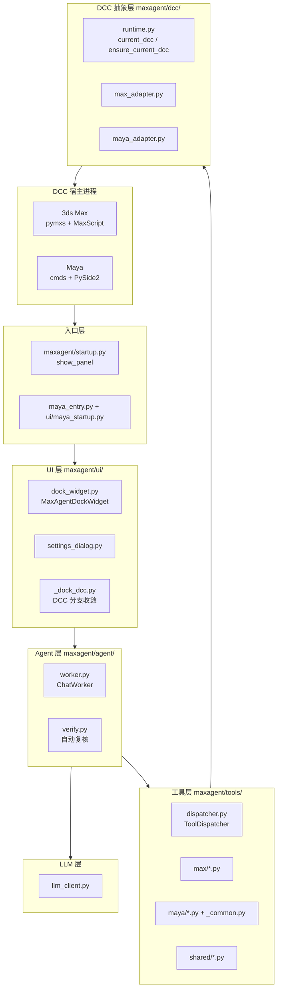
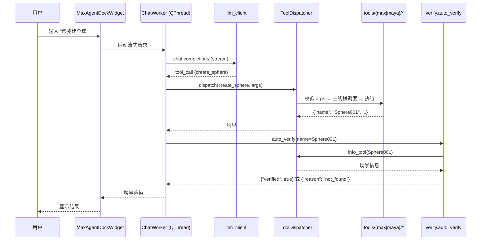

# MaxAgent 架构总览

> 本文档给出 MaxAgent 的高层模块划分与运行时依赖，配合 `docs/dual_dcc_diff.md` 一起看。
> 目的：新加入者能在 10 分钟内定位到"某个功能落在哪一层"。

## 1. 顶层分层

## 2. 目录职责一览

- `maxagent/agent/`：对话循环、工具复核、流式输出组装。`worker.py` 是主线程外的 `QThread`；`verify.py` 独立于线程负责"这条工具调用需要复核吗"。
- `maxagent/tools/`：工具注册、参数校验、真实执行。`dispatcher.py` 统一入口；`max/`、`maya/`、`shared/` 各自实现具体工具；Maya 的公共校验/回滚在 `tools/maya/_common.py`。
- `maxagent/dcc/`：DCC 差异隔离层。`runtime.py` 是唯一的 DCC 身份来源（`current_dcc()` / `ensure_current_dcc()`），任何"我现在在 Max 还是 Maya"的判断都必须经此。
- `maxagent/ui/`：Qt/PySide 界面。跨 DCC 分支收敛到 `_dock_dcc.py`（标题、Dock 创建 dispatch）。
- `maxagent/llm_client.py`：OpenAI 兼容协议的 HTTP 客户端，纯 urllib 实现，零外部依赖。
- `maxagent/config.py` / `maxagent/skills.py` / `maxagent/session.py`：本地配置、技能、会话历史，均落到 `config_dir` 下。
- `maxagent/reload.py`：开发期热重载入口（`print` 到控制台是设计，用于给 DCC 用户看进度）。
- `release/`：打包脚本；`--target max|maya|full` 分别产出 `.mzp`（Max）与 `.zip`（Maya）。

## 3. 运行时数据流（一次工具调用）

## 4. 关键设计约束

- **DCC 身份铁律**：`current_dcc()` 只在启动入口设置一次（`ensure_current_dcc`），运行中禁止再写。
- **主线程调度**：所有 DCC API 调用必须回到主线程（`run_on_main`），Worker 线程只做 IO/组装。
- **零外部依赖**：LLM/HTTP 用 urllib，避免在 DCC 内触发 pip 安装。
- **兼容矩阵**：3ds Max 2022~2027，Python 3.7~3.13，PySide2 + PySide6 双支持。
- **打包分层**：源码直出，无 Cython/PyArmor；`release/build.py` 按 target 过滤 `tools/`、`dcc/`、`ui/` 目录后压缩。
