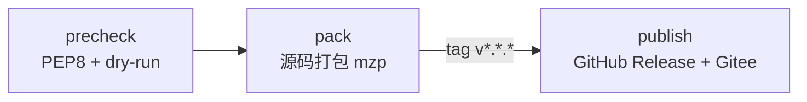

# CI / CD 工作流说明

MaxAgent 已开源，构建流水线简化为 **源码直出 mzp**：单 job 完成打包，无需多 ABI 矩阵，
不涉及 Cython / PyArmor / 字节码保护。

## 流水线选择

| 平台                 | 配置文件                              | 用途             |
|---------------------|--------------------------------------|------------------|
| **GitHub Actions**  | `.github/workflows/release.yml`      | **主流水线**     |
| 工蜂蓝盾             | `release/ci/bk-pipelines.yml`        | 备用方案         |

## 触发条件

| 事件                        | 行为                                    |
|---------------------------|---------------------------------------|
| `push tag v*.*.*`         | 打包 → **发布到 Release**              |
| `push to master`          | 预检 + 打包（不发布）                   |
| `pull_request to master`  | 仅预检                                 |
| `workflow_dispatch`       | 手动触发                                |

## 流水线阶段



### 阶段 1 — precheck

- PEP8 lint（`flake8 maxagent/`）
- Python 3.13 兼容性 grep（`asyncio.get_event_loop` / `distutils`）
- `build.py --dry-run` 验证

### 阶段 2 — pack

- 直接跑 `python release/build.py --verbose`
- 上传 `release/dist/*.mzp` 为 artifact

### 阶段 3 — publish（仅 tag 触发）

- 创建 GitHub Release（自动生成 Notes）
- 同步推送到 Gitee Release（当 `secrets.GITEE_TOKEN` 存在时）

## CI Secrets 配置

| Secret 名        | 必要性 | 用途                        | 不配置时行为              |
|-----------------|------|---------------------------|---------------------|
| `GITEE_TOKEN`   | 可选  | Gitee 个人 access_token   | 跳过 Gitee Release 同步 |

## 发版流程

```bash
# 1. 更新版本号
vim release/version.py     # 改 __version__

# 2. 提交 + 推送
git add release/version.py
git commit -m "release: bump version to X.Y.Z"
git push origin master

# 3. 打 tag 触发 CI
git tag vX.Y.Z
git push origin vX.Y.Z    # 已配置双 push URL，会同步到 Gitee
```

CI 会在几分钟内自动产出并发布 `maxagent-X.Y.Z.mzp`。

## 本地手动打包

```bash
python release/build.py --dry-run   # 只校验，不产出
python release/build.py --verbose   # 产出到 release/dist/
```
