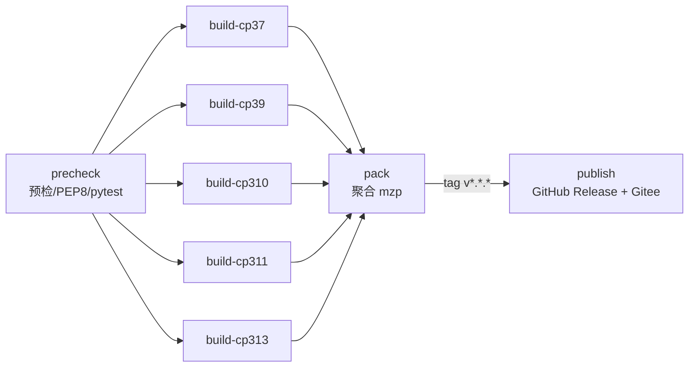

# CI / CD 工作流说明

MaxAgent 采用 **多 ABI 矩阵构建** 策略：每个 Python 版本（cp37/cp39/cp310/cp311/cp313）
在独立 Windows runner 上分别编译 `.pyd`，最后聚合成单个跨版本 `.mzp` 包。

## 流水线选择

| 平台                 | 配置文件                              | 用途             | 强度  |
|---------------------|--------------------------------------|------------------|-------|
| **GitHub Actions**  | `.github/workflows/release.yml`      | **主流水线**     | 推荐  |
| 工蜂蓝盾             | `release/ci/bk-pipelines.yml`        | 内网备份         | 备用  |

> 默认走 GitHub Actions —— 配置标准、文档丰富、Windows runner 免费。
> 工蜂蓝盾配置作为内部托管的镜像方案，仅在 GitHub Actions 不可用时启用。

## 触发条件

| 事件                        | 行为                                    |
|---------------------------|---------------------------------------|
| `push tag v*.*.*`         | 全量构建 → 打包 → **发布到 Release**    |
| `push to master`          | 全量构建 → 打包（不发布）               |
| `pull_request to master`  | 仅跑 cp311 冒烟                        |
| `workflow_dispatch`       | 手动触发，可调试                        |

## 流水线阶段



### 阶段 1 — precheck（Linux）

- PEP8 lint
- Python 3.13 兼容性 grep（`asyncio.get_event_loop` / `distutils`）
- 全量回归测试（633 项含 release pipeline 慢测）
- `build.py --dry-run` 验证

### 阶段 2 — build（Windows，5 ABI 并行）

- 装对应 Python（3.7.9 / 3.9.7 / 3.10.8 / 3.11.9 / 3.13.9）
- 装 MSVC（Cython 编译需要）
- 装 Cython >= 3.0.11 / PyArmor >= 8.5.11
- 注册 PyArmor license（仅当 `secrets.PYARMOR_LICENSE` 存在）
- 跑 `python release/build.py --abis cpXX`
- **自检**：明文白名单存在 + `.pyd` 数量 >= 1
- 上传 `release/build_cache/cpXX/` 为 artifact

### 阶段 3 — pack（Windows）

- 下载 5 个 `build-cpXX` artifact
- 重组为 `release/build_cache/cpXX/` 目录结构
- 跑 `python release/build.py --pack-only --abis cp37 cp39 cp310 cp311 cp313`
- 上传 `*.mzp` 为发布制品

### 阶段 4 — publish（仅 tag 触发）

- 创建 GitHub Release（自动生成 Notes）
- 同步推送到 Gitee Release（仅当 `secrets.GITEE_TOKEN` 存在）

## CI Secrets 配置

在 GitHub 仓库的 Settings → Secrets and variables → Actions 中配置：

| Secret 名             | 必要性 | 用途                              | 不配置时行为                       |
|----------------------|------|----------------------------------|------------------------------|
| `PYARMOR_LICENSE`    | 可选  | PyArmor 商业 license（注册码字符串）  | trial 兜底（保护强度 L1+L3）     |
| `GITEE_TOKEN`        | 可选  | Gitee 个人 access_token            | 跳过 Gitee Release 同步         |

> **当前默认策略**：均不配置，使用 trial 模式。
> 后续如需提升保护强度到 L2 或开启 Gitee 同步，再补充对应 secret。

## 本地手动测试 CI 行为

### 单 ABI 完整跑通（开发期）

```bash
python release/build.py --quick                   # 仅当前 ABI（最快）
python release/build.py --abis cp311              # 指定 ABI
```

### 模拟 CI 的 pack-only 阶段

```bash
# 1. 先在不同 Python 环境分别跑 build_cache 产物（或本地用 --quick 产 1 个）
# 2. 然后跑聚合：
python release/build.py --pack-only --abis cp311
```

### 模拟 Gitee 发布（需真 token）

```bash
export GITEE_TOKEN='your_token_here'
python release/ci/publish_gitee.py --version 0.4.0
```

## 发版流程

### 标准发版流程

```bash
# 1. 更新版本号
vim release/version.py     # 改 __version__

# 2. 更新 CHANGELOG（可选）
vim CHANGELOG.md

# 3. 提交 + 推送
git add release/version.py CHANGELOG.md
git commit -m "release: bump version to X.Y.Z"
git push origin master

# 4. 打 tag 触发 CI
git tag vX.Y.Z
git push origin vX.Y.Z
git push gitee vX.Y.Z       # 双仓同步
```

CI 会在 ~10 分钟内自动产出并发布 `maxagent-X.Y.Z.mzp`。

### Hotfix 流程

仅打补丁号：`v0.4.0` → `v0.4.1`，按上述标准流程走即可。

### 预发版（beta）

打 `v0.5.0-beta.1` tag。CI 默认仍走完整流程；
若希望标记为 prerelease 而非正式 release，
可手动在 workflow_dispatch 中勾选 `prerelease`，
或在 `publish_gitee.py` 调用时加 `--prerelease`。

## 故障排查

| 现象                                  | 原因                              | 解决                                            |
|--------------------------------------|---------------------------------|-----------------------------------------------|
| build job 卡在装 MSVC                 | runner 缓存失效                   | rerun job 即可（GitHub 通常 5min 内恢复）        |
| build job 报 `.pyd` 缺失              | Cython 编译失败                   | 看构建日志的 `cythonize` 输出，多半是 C 编译错  |
| pack job 报 ABI 缺失                  | 某个 build job 失败              | 重跑失败的 build matrix job                    |
| publish job 报 Gitee 401              | `GITEE_TOKEN` 过期或权限不足      | 重新生成 token，更新 secret                     |
| publish 后 Release 页面无 mzp         | 上传超时（mzp > 100 MB）          | 当前 mzp ~3.5 MB，不应触发；如触发需分片上传   |

## 维护检查清单

| 频率   | 任务                                          |
|------|---------------------------------------------|
| 每月   | 检查 GitHub Actions 是否有新版 actions（uses 行升级） |
| 每季度 | 检查 PyArmor / Cython 是否有重要安全更新            |
| 每发版 | tag 推送前先在 master 跑一次 master 触发的流水线确认健康 |
| 重大变更 | Max 新版本发布时，更新 `release/version.py` 中 `SUPPORTED_ABIS` |
